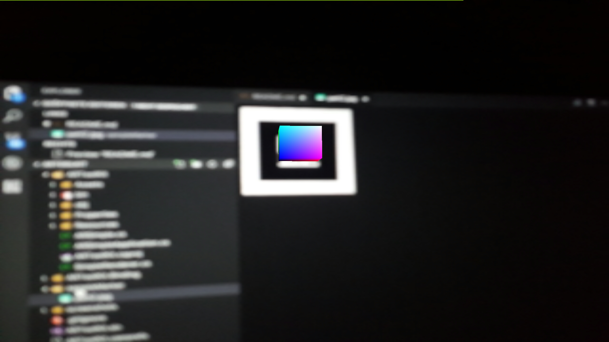

## ARToolkit5 Binding and example "SimpleAR" project for Xamarin.Android

This project contains the Android ARToolKit5 Bindings for the Xamarin Platform and an example App.

#### Links:
ARtoolKit SDK: https://github.com/artoolkit/artoolkit5

ARToolKit AAR: https://github.com/KevinGliewe/ARToolKit5AAR

#### Sample marker:


#### Sample usage:

```CS
/**
 * A very simple Renderer that adds a marker and draws a cube on it.
 */
public class SimpleRenderer: ARRenderer
{
	private int markerID = -1;

	private Cube cube = new Cube(40.0f, 0.0f, 0.0f, 20.0f);
	private float angle = 0.0f;
	private bool spinning = false;

	public override bool ConfigureARScene()
	{
		
		markerID = Org.Artoolkit.AR.Base.ARToolKit.Instance.AddMarker("single;Data/patt.hiro;80");
		if (markerID < 0) return false;

		return true;
	}

	public void Click() {
		spinning = !spinning;
	}

	public override void Draw(IGL10 gl) {
		gl.GlClear(GL10.GlColorBufferBit | GL10.GlDepthBufferBit);

		gl.GlMatrixMode(GL10.GlProjection);
		gl.GlLoadMatrixf(Org.Artoolkit.AR.Base.ARToolKit.Instance.GetProjectionMatrix(), 0);

		gl.GlEnable(GL10.GlCullFaceCapability);
		gl.GlShadeModel(GL10.GlSmooth);
		gl.GlEnable(GL10.GlDepthTest);
		gl.GlFrontFace(GL10.GlCw);

		gl.GlMatrixMode(GL10.GlModelview);

		if (Org.Artoolkit.AR.Base.ARToolKit.Instance.QueryMarkerVisible(markerID))
		{

			gl.GlLoadMatrixf(Org.Artoolkit.AR.Base.ARToolKit.Instance.QueryMarkerTransformation(markerID), 0);

			gl.GlPushMatrix();
			gl.GlRotatef(angle, 0.0f, 0.0f, 1.0f);
			cube.Draw(gl);
			gl.GlPopMatrix();

			if (spinning) angle += 5.0f;
		}
	}
}
```



## Authors

* **Kevin Gliewe** - [KevinGliewe](https://github.com/KevinGliewe)

## License

This project is licensed under the MIT License - see the [LICENSE.md](LICENSE.md) file for details